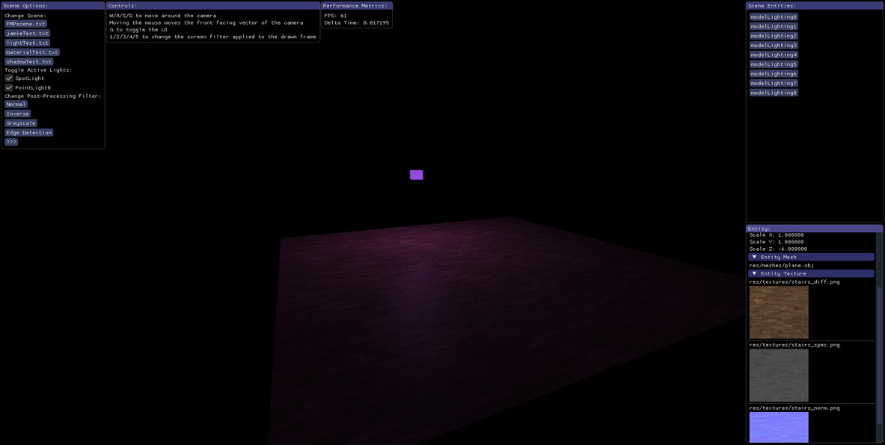
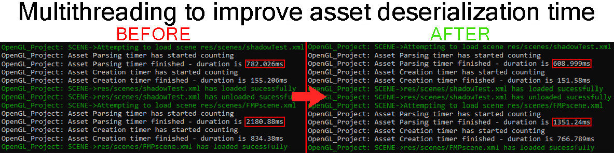
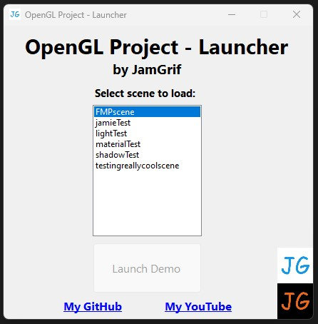
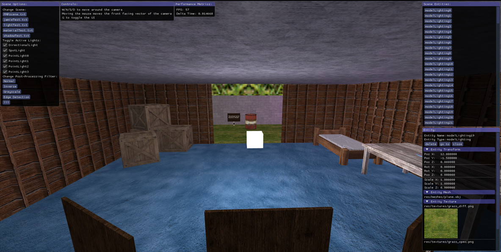
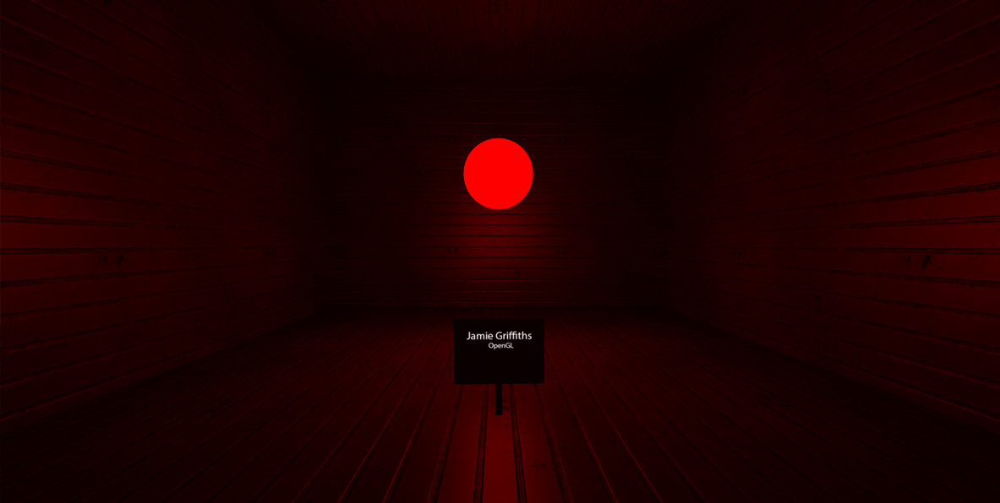
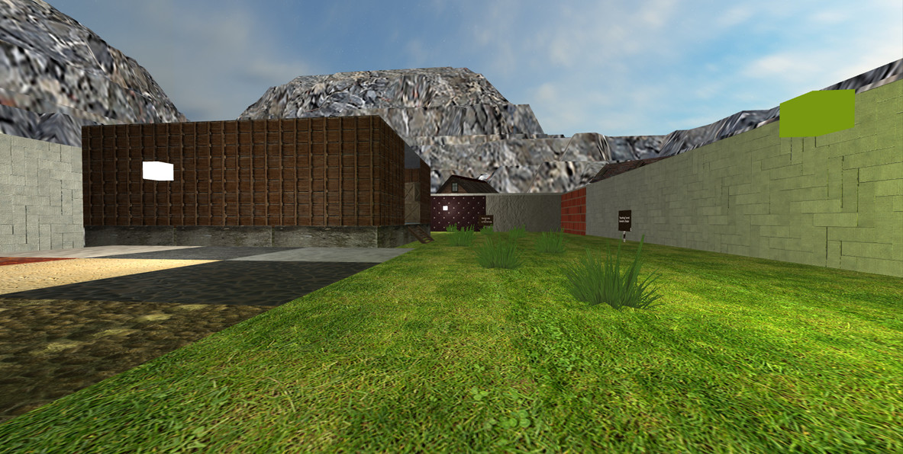

# OpenGL Project

A C++ 3D renderer in OpenGL, with a variety of additional libraries, which is launched through C# WinForms that includes a large collection of graphical features and more by parsing a custom .xml scene file which contains all the requirements and components of a 3D scene

**The project is split into:**  
- **Engine** project which creates the .lib file and contains the heavy work 
- **Demo** project which creates an .exe file, by using the Engine.lib, and is launched by the Launcher to create the OpenGL window
- **Launcher** project which uses WinForms (C#) to provide a way to specify which initial scene will be loaded when launching the Demo .exe

I have been further developing this project in my own time for fun as it is a good way to experiement with and test my OpenGL, C++, C# and general softare design ability, while also allowing me to push myself to learn more by implementating new features

If you are having problems building the solution as a result of LauncherForm.resx, follow this:  
1. Move the solution folder to outside the downloads directory  
2. Unblock LauncherForm.resx file in File Explorer properties window (file found at SolutionDirectory/Launcher/  
3. Restart Visual Studio  

**OLD** Renderer Showcase Video - https://www.youtube.com/watch?v=QOnscYxgrNQ

# Features

**New features over the original FMP version:**  
- WinForms launcher to specify which initial scene will be loaded
- Multithreading for asset loading (textures, meshes & shader sources)  
- Scene .XML loading during runtime  
- Split the project into an Engine .lib and a Demo .exe  
- ImGui interface with a scene editor (Change scene, change screen filter, adjust lights status, view and delete entity values)  
- Improved logging with better timer and error handling  
- Material system and better asset management system (Texture, Mesh, Shader, Cubemap)
- General bug fixes, optimizations and design pattern implementations  

**Original features:**  
- ADS Blinn-Phong Light Reflection Model  
- Diffuse, Specular, Emission, Height & Normal texture maps
- Coloured lighting from Directional/Point/Spot lights  
- Skybox Cubemap  
- Reflection Environment Map & Refraction Environment Map  
- Mountains via Height Map with Tessellation shaders  
- Model inflation via Geometry shader  
- Post-processing screen filters  
- Load external 3D models, textures & shaders  
- Parallax mapping   
- Sprite blending  
- Mouse + keyboard input with camera movement on all 3 axis  

# Building

Built exe is available at (SolutionDirectory)->Demo->x64->Release/Debug->Demo.exe  
Program can only be compiled in 64bit mode in Visual Studio.  
The Debug version enables the console and console logging, but the Release version has superior performance and loading.    
The solution should be able to be built straight out-of-the-box.  

**This OpenGL Project is dependant on:**

[assimp](https://github.com/assimp/assimp)

[GLEW](https://github.com/nigels-com/glew)

[GLFW](https://github.com/glfw/glfw)

[glm](https://github.com/g-truc/glm)

[imgui](https://github.com/ocornut/imgui)

[spdlog](https://github.com/gabime/spdlog)

[stb_image](https://github.com/nothings/stb)

# Controls

**W/A/S/D** to move around the camera  
Moving the mouse moves the front facing vector of the camera  
**1/2/3/4/5** to change the screen filter applied to the drawn frame  
	1 Normal  
	2 Inverse  
	3 Greyscale  
	4 Edge detection  
	5 ???  
**Q** to toggle the UI

